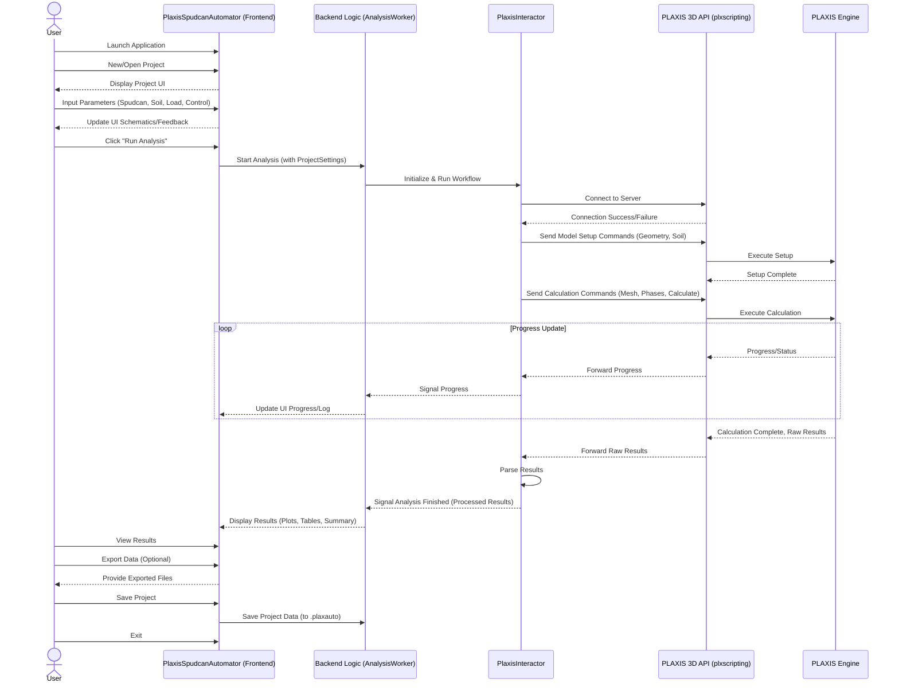

# PLAXIS 3D Spudcan Penetration Automation Tool

[中文版 README (Chinese README)](readme_zh.md)

The PLAXIS 3D Spudcan Penetration Automation Tool is a desktop application designed to streamline and automate the process of spudcan penetration analysis using PLAXIS 3D. It provides a user-friendly graphical interface for inputting parameters, controlling the analysis, and viewing results, all based on the workflow detailed in "基于PLAXIS3D的海洋桩靴入泥深度设计流程.pdf".

## Features

*   **Project Management:** Create, save, and load analysis projects.
*   **Intuitive Data Input:**
    *   Define spudcan geometry with visual feedback.
    *   Specify multi-layer soil stratigraphy and material properties for various soil models (e.g., Mohr-Coulomb, Hardening Soil).
    *   Input loading conditions and analysis control parameters.
    *   Configure water table depth.
*   **Automated PLAXIS Workflow:**
    *   Generates PLAXIS commands/scripts based on user input.
    *   Manages the execution of PLAXIS analysis in a separate thread to keep the UI responsive.
    *   Provides real-time progress updates and logs.
*   **Results Visualization:**
    *   Displays key results such as final penetration depth and peak resistance.
    *   Plots load-penetration curves using Matplotlib.
    *   Shows detailed results in a table.
*   **Data Export:** Export plots as images and tabular data as CSV files.
*   **Configuration:** Set the path to the local PLAXIS installation.

## Technical Stack

*   **Backend Logic:** Python (3.12 used during development)
*   **Graphical User Interface (GUI):** PySide6 (Qt6 bindings for Python)
*   **PLAXIS Interaction:**
    *   Primarily uses the PLAXIS Python Scripting API.
    *   Utilizes the custom `plxscripting` library (version 1.0.4, included in `docs/`) for API communication.
    *   Fallback capability for PLAXIS Command Line Interface (CLI) is present in the interactor design but primarily API-driven.
*   **Data Handling:**
    *   Project files: JSON for saving/loading project settings.
    *   Tabular data: Pandas and Openpyxl for potential data manipulation and export (though current export is direct CSV).
*   **Plotting:** Matplotlib for generating load-penetration curves.
*   **Application Packaging:** PyInstaller (script available in `build.sh`).
*   **Testing:** Pytest framework with `pytest-qt` and `pytest-mock`.

## Core Principles / Architecture

The application is structured into a frontend (GUI) and a backend (logic and PLAXIS interaction).

```mermaid
graph TD
    A[User Interface (Frontend - PySide6 - src/frontend/)] -->|User Actions, Data Models| B(Backend Logic - Python - src/backend/);
    B -->|Commands, Control, Data| C(PLAXIS Interactor - Python - src/backend/plaxis_interactor/interactor.py);
    C -->|Python Scripting API / CLI| D[PLAXIS 3D Software];

    subgraph A
        direction LR
        A1[Project Management];
        A2[Input Widgets];
        A3[Execution Controls & Progress];
        A4[Results Display];
        A5[Configuration Dialog];
    end

    subgraph B
        direction LR
        B1[Data Models];
        B2[Project I/O];
        B3[Input Validation];
        B4[Analysis Worker QThread];
    end

    subgraph C
        direction LR
        C1[API Connection Mgmt (plxscripting)];
        C2[Command Generation (Builders)];
        C3[PLAXIS Operation Execution];
        C4[Results Extraction (Parsers)];
        C5[Error Handling & Logging];
    end
```

## User Interaction Workflow

The typical user interaction flow is as follows:

1.  **Launch & Project:** User starts the application, then creates a new project or opens an existing one.
2.  **Data Input:** User navigates through UI sections to input Spudcan Geometry, Soil Stratigraphy, Material Properties, Loading Conditions, and Analysis Control parameters.
3.  **Configuration (Optional):** User may set the PLAXIS installation path via File > Settings.
4.  **Run Analysis:** User clicks "Run Analysis". The application validates inputs and then initiates the analysis process with PLAXIS via the backend interactor.
5.  **Monitor:** User observes progress and logs displayed in the UI.
6.  **View & Export Results:** After completion, results (summary, plots, tables) are displayed. User can export these.
7.  **Save & Exit:** User saves the project and exits.



## Installation

1.  **Prerequisites:**
    *   Python (3.10+ recommended, 3.12 used for development). Ensure Python is added to your system's PATH.
    *   PLAXIS 3D: A licensed and installed version of PLAXIS 3D that supports the Python scripting API.
    *   Git (for cloning the repository).

2.  **Clone the Repository:**
    ```bash
    git clone <repository_url>
    cd <repository_directory>
    ```

3.  **Create a Virtual Environment (Recommended):**
    ```bash
    python -m venv venv
    source venv/bin/activate  # On Windows: venv\Scripts\activate
    ```

4.  **Install Python Dependencies:**
    ```bash
    pip install -r requirements.txt
    ```

5.  **Install `plxscripting` Library:**
    This project uses a specific version of the `plxscripting` library which is included in the `docs/` directory. Install it in editable mode:
    ```bash
    pip install -e ./docs/plxscripting-1.0.4/
    ```

## Running the Application

1.  Ensure your virtual environment is activated if you created one.
2.  Navigate to the root directory of the project.
3.  Run the main application script:
    ```bash
    python -m src.main
    ```

**Notes for Running:**

*   **X Server Requirement (Linux/macOS):** This is a GUI application and requires a running X server to display.
    *   On Linux systems without a desktop environment (e.g., headless servers, some Docker containers), you may need to use Xvfb (X Virtual Frame Buffer):
        ```bash
        # Install Xvfb (example for Debian/Ubuntu)
        # sudo apt-get update && sudo apt-get install -y xvfb

        xvfb-run python -m src.main
        ```
*   **PLAXIS API Configuration:**
    *   Ensure the PLAXIS API service is enabled and the password is correctly configured within PLAXIS.
    *   The application will attempt to connect to the PLAXIS API on `localhost` using default ports (Input: 10000, Output: 10001) and a default password placeholder. You might need to configure these in the application settings (File > Settings) if your PLAXIS API setup differs or if the default password in `src/backend/plaxis_interactor/interactor.py` (`YOUR_API_PASSWORD`) has not been updated.
*   **PLAXIS Installation Path:** The application may need the path to your PLAXIS installation executable. This can usually be set via **File > Settings** in the application.

## Building the Application

A `build.sh` script is provided for creating a standalone executable using PyInstaller.

1.  Ensure PyInstaller is installed:
    ```bash
    pip install pyinstaller
    ```
2.  Make the script executable (if needed):
    ```bash
    chmod +x build.sh
    ```
3.  Run the build script:
    ```bash
    bash build.sh
    ```
    The bundled application will be located in the `dist/PlaxisSpudcanAutomator` directory.

## Running Tests

The project uses `pytest` for testing.

1.  Ensure test dependencies are installed (they are included in `requirements.txt`).
2.  Navigate to the root directory of the project.
3.  Run tests:
    ```bash
    python -m pytest tests/
    ```

## Notes and Known Issues

*   **`plxscripting library not found` Runtime Warning:**
    When running `python -m src.main`, a warning "plxscripting library not found. PlaxisInteractor will not be able to connect to PLAXIS API." may appear in the console output. This is despite the library being correctly installed via `pip install -e ./docs/plxscripting-1.0.4/` and verifiable via `python -c "import plxscripting"`. This suggests a Python path or environment subtle difference when the full application is launched versus a direct import test. While the GUI starts, this could impact PLAXIS API connectivity. Further investigation is needed if direct PLAXIS interaction fails.
*   **Qt XCB Platform Plugin Issues (Linux):**
    Running Qt applications in some Linux environments (especially minimal or headless ones) can lead to errors like "Could not load the Qt platform plugin 'xcb'". To resolve these during development and for headless execution with Xvfb, several XCB and XKB related libraries were found to be necessary. These include:
    *   `libxcb-cursor0`
    *   `libxkbcommon-x11-0`
    *   `libxcb-icccm4`
    *   `libxcb-image0`
    *   `libxcb-keysyms1`
    *   `libxcb-randr0`
    *   `libxcb-render-util0`
    *   `libxcb-shape0`
    *   `libxcb-xfixes0`
    *   And `xvfb` itself for running in headless environments.
    If you encounter similar Qt platform issues, ensure these (or their equivalents for your distribution) are installed.
*   **PLAXIS Software Dependency:** Full functionality of this tool (i.e., running actual analyses) is dependent on a licensed and working installation of PLAXIS 3D with its Python scripting API enabled and accessible.

```
