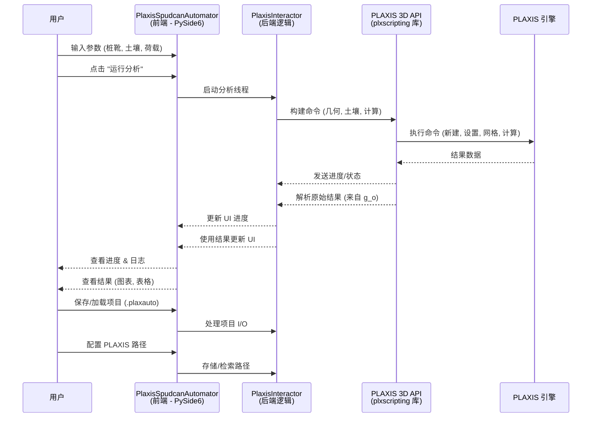

# PLAXIS 3D 桩靴贯入自动化工具

[View English Version (查看英文版)](readme.md)

PLAXIS 3D 桩靴贯入自动化工具是一款桌面应用程序，旨在简化和自动化使用 PLAXIS 3D 进行桩靴贯入分析的过程。它提供了一个用户友好的图形界面，用于输入参数、控制分析和查看结果，所有这些都基于 "基于PLAXIS3D的海洋桩靴入泥深度设计流程.pdf" 中详述的工作流程。

## 主要功能

*   **项目管理:** 创建、保存和加载分析项目。
*   **直观的数据输入:**
    *   定义桩靴几何形状，并提供可视化反馈。
    *   为多种土体模型（例如，Mohr-Coulomb、Hardening Soil）指定多层土层和材料属性。
    *   输入加载条件和分析控制参数。
    *   配置地下水位深度。
*   **自动化的 PLAXIS 工作流:**
    *   根据用户输入生成 PLAXIS 命令/脚本。
    *   在单独的线程中管理 PLAXIS 分析的执行，以保持用户界面的响应性。
    *   提供实时进度更新和日志。
*   **结果可视化:**
    *   显示最终贯入深度和峰值阻力等关键结果。
    *   使用 Matplotlib 绘制荷载-贯入曲线。
    *   在表格中显示详细结果。
*   **数据导出:** 将图表导出为图像，将表格数据导出为 CSV 文件。
*   **配置:** 设置本地 PLAXIS 安装路径。

## 技术栈

*   **后端逻辑:** Python (开发过程中使用 3.12 版本)
*   **图形用户界面 (GUI):** PySide6 (Python 的 Qt6 绑定)
*   **PLAXIS 交互:**
    *   主要使用 PLAXIS Python 脚本 API。
    *   使用自定义的 `plxscripting` 库 (版本 1.0.4, 包含在 `docs/` 目录下) 进行 API 通信。
    *   交互器设计中包含对 PLAXIS 命令行界面 (CLI) 的备用支持，但主要通过 API 驱动。
*   **数据处理:**
    *   项目文件: JSON 用于保存/加载项目设置。
    *   表格数据: Pandas 和 Openpyxl 用于潜在的数据操作和导出 (尽管当前导出为直接的 CSV)。
*   **绘图:** Matplotlib 用于生成荷载-贯入曲线。
*   **应用程序打包:** PyInstaller (脚本位于 `build.sh`)。
*   **测试:** Pytest 框架，以及 `pytest-qt` 和 `pytest-mock`。

## 核心原理 / 架构

该应用程序在结构上分为前端 (GUI) 和后端 (逻辑与 PLAXIS 交互)。

```mermaid
graph TD
    A[用户界面 (前端)<br>(PySide6 - src/frontend/)] -->|用户操作, 数据模型| B(后端逻辑 (Python)<br>(src/backend/))
    B -->|命令, 控制, 数据| C(PLAXIS 交互器 (Python)<br>(src/backend/plaxis_interactor/interactor.py))
    C -->|Python 脚本 API / CLI| D(PLAXIS 3D 软件)

    subgraph A [用户界面 (前端)]
        direction TB
        A1[项目管理 (新建, 保存, 加载)]
        A2[输入组件 (桩靴几何, 土壤, 加载, 分析控制)]
        A3[执行控制 (运行, 停止) & 进度显示]
        A4[结果显示 (图表, 表格, 摘要)]
        A5[配置对话框]
    end

    subgraph B [后端逻辑 (Python)]
        direction TB
        B1[数据模型 (ProjectSettings, SpudcanGeometry, SoilLayer, 等.)]
        B2[项目 I/O (保存/加载 JSON - project_io.py)]
        B3[输入验证 (validation.py)]
        B4[分析工作器 (main_window.py 中的 QThread 管理交互器)]
    end

    subgraph C [PLAXIS 交互器 (Python)]
        direction TB
        C1[管理与 PLAXIS 的连接 (通过 plxscripting 连接输入/输出服务器)]
        C2[将 UI 数据转换为 PLAXIS API 命令 (使用 builder 模块)<br>- 几何构建器<br>- 土壤构建器<br>- 计算构建器]
        C3[执行 PLAXIS 操作 (设置, 网格划分, 计算)]
        C4[使用 PLAXIS API 提取结果 (通过 results_parser 模块)]
        C5[处理 PLAXIS 特定错误和日志记录]
    end
```

## 用户交互工作流

1.  **启动应用程序:** 用户启动 PlaxisSpudcanAutomator。
2.  **项目设置:**
    *   用户创建 **新项目** 或 **打开现有项目** (`.plaxauto` JSON 文件)。
    *   用户可以输入/修改项目信息 (名称, 工作编号, 分析员)。
3.  **定义输入 (通过专门的 UI 部分):**
    *   **桩靴几何:** 输入直径、锥角。示意图会实时更新。
    *   **土层与属性:** 添加/修改土层 (厚度, 材料选择)。对于每种材料，根据选择的土模型 (例如 Mohr-Coulomb) 定义属性 (例如，单位重量, E', c', phi')。设置地下水位深度。示意图会更新。
    *   **加载条件:** 指定垂向预压荷载、目标控制类型 (贯入度/荷载) 和目标值。
    *   **分析控制:** 设置网格粗糙度、初始应力计算方法和迭代控制等参数。
4.  **配置设置 (可选):**
    *   用户导航至 **文件 > 设置** 以配置其 PLAXIS 安装可执行文件的路径 (如果未设置或不正确)。
5.  **运行分析:**
    *   用户点击 "运行分析" 按钮。
    *   应用程序验证输入。如果无效，则提示用户更正。
    *   后端 `AnalysisWorker` (在单独的线程中) 初始化 `PlaxisInteractor`。
    *   `PlaxisInteractor` 连接到 PLAXIS API (使用 `plxscripting`)。
    *   **模型设置:** 命令被发送到 PLAXIS 以创建几何体、定义材料并构建土体模型。
    *   **计算:** 在 PLAXIS 中执行网格划分、初始条件和分阶段施工 (贯入)。
    *   UI 显示进度更新和日志消息。
6.  **查看结果:**
    *   PLAXIS 计算完成后，`PlaxisInteractor` 提取结果。
    *   UI 中的 "结果" 部分被填充:
        *   摘要: 最终贯入度, 峰值抗力。
        *   图表: 荷载-贯入曲线。
        *   表格: 曲线的详细数据点。
7.  **导出数据 (可选):**
    *   用户可以将图表导出为图像或将结果表导出为 CSV 文件。
8.  **保存项目:** 用户将当前项目设置 (以及结果，如果可用) 保存到 `.plaxauto` 文件。
9.  **退出:** 用户关闭应用程序。



## 安装

1.  **先决条件:**
    *   Python (推荐 3.10+，开发使用 3.12)。确保 Python已添加到系统的 PATH 中。
    *   PLAXIS 3D: 已获得许可并正确安装的 PLAXIS 3D 版本，且该版本支持 Python 脚本 API。
    *   Git (用于克隆代码库)。

2.  **克隆代码库:**
    ```bash
    git clone <repository_url>
    cd <repository_directory>
    ```

3.  **创建虚拟环境 (推荐):**
    ```bash
    python -m venv venv
    source venv/bin/activate  # Windows 上: venv\Scripts\activate
    ```

4.  **安装 Python 依赖:**
    ```bash
    pip install -r requirements.txt
    ```

5.  **安装 `plxscripting` 库:**
    本项目使用特定版本的 `plxscripting` 库，该库包含在 `docs/` 目录中。以可编辑模式安装它：
    ```bash
    pip install -e ./docs/plxscripting-1.0.4/
    ```

## 运行应用程序

1.  如果创建了虚拟环境，请确保已激活。
2.  导航到项目的根目录。
3.  运行主应用程序脚本:
    ```bash
    python -m src.main
    ```

**运行注意事项:**

*   **X Server 要求 (Linux/macOS):** 这是一个 GUI 应用程序，需要正在运行的 X Server 才能显示。
    *   在没有桌面环境的 Linux 系统上 (例如，无头服务器、某些 Docker 容器)，您可能需要使用 Xvfb (X 虚拟帧缓冲):
        ```bash
        # 安装 Xvfb (Debian/Ubuntu 示例)
        # sudo apt-get update && sudo apt-get install -y xvfb

        xvfb-run python -m src.main
        ```
*   **PLAXIS API 配置:**
    *   确保 PLAXIS API 服务已启用，并且在 PLAXIS 中正确配置了密码。
    *   应用程序将尝试使用默认端口 (输入: 10000, 输出: 10001) 和默认密码占位符连接到 `localhost` 上的 PLAXIS API。如果您的 PLAXIS API 设置不同，或者 `src/backend/plaxis_interactor/interactor.py` 中的默认密码 (`YOUR_API_PASSWORD`) 尚未更新，您可能需要在应用程序设置 (文件 > 设置) 中配置这些信息。
*   **PLAXIS 安装路径:** 应用程序可能需要您的 PLAXIS 安装可执行文件的路径。这通常可以在应用程序的 **文件 > 设置** 中设置。

## 构建应用程序

项目提供了一个 `build.sh` 脚本，用于使用 PyInstaller 创建独立的可执行文件。

1.  确保已安装 PyInstaller:
    ```bash
    pip install pyinstaller
    ```
2.  使脚本可执行 (如果需要):
    ```bash
    chmod +x build.sh
    ```
3.  运行构建脚本:
    ```bash
    bash build.sh
    ```
    打包后的应用程序将位于 `dist/PlaxisSpudcanAutomator` 目录中。

## 运行测试

项目使用 `pytest` 进行测试。

1.  确保已安装测试依赖项 (它们包含在 `requirements.txt` 中)。
2.  导航到项目的根目录。
3.  运行测试:
    ```bash
    python -m pytest tests/
    ```

## 注意事项和已知问题

*   **`plxscripting library not found` 运行时警告:**
    运行 `python -m src.main` 时，控制台输出中可能会出现 "plxscripting library not found. PlaxisInteractor will not be able to connect to PLAXIS API." 的警告。尽管该库已通过 `pip install -e ./docs/plxscripting-1.0.4/` 正确安装，并且可以通过 `python -c "import plxscripting"` 进行验证，但此警告仍然存在。这表明在完整应用程序启动时，Python 路径或环境与直接导入测试时存在细微差别。虽然 GUI 可以启动，但这可能会影响 PLAXIS API 的连接性。如果直接的 PLAXIS 交互失败，则需要进一步调查。
*   **Qt XCB 平台插件问题 (Linux):**
    在某些 Linux 环境 (特别是最小化或无头环境) 中运行 Qt 应用程序可能会导致类似 "Could not load the Qt platform plugin 'xcb'" 的错误。为了在开发过程中以及在无头环境中使用 Xvfb 执行时解决这些问题，发现需要安装几个 XCB 和 XKB 相关的库。这些包括：
    *   `libxcb-cursor0`
    *   `libxkbcommon-x11-0`
    *   `libxcb-icccm4`
    *   `libxcb-image0`
    *   `libxcb-keysyms1`
    *   `libxcb-randr0`
    *   `libxcb-render-util0`
    *   `libxcb-shape0`
    *   `libxcb-xfixes0`
    *   以及用于在无头环境中运行的 `xvfb` 本身。
    如果您遇到类似的 Qt 平台问题，请确保已安装这些库 (或适用于您发行版的等效库)。
*   **PLAXIS 软件依赖:** 此工具的全部功能 (即运行实际分析) 取决于已获得许可且正常工作的 PLAXIS 3D 安装，并且其 Python 脚本 API 已启用且可访问。
